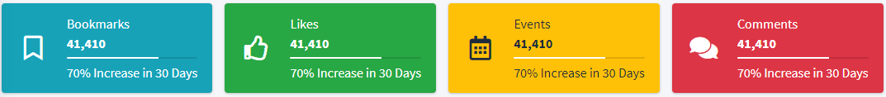
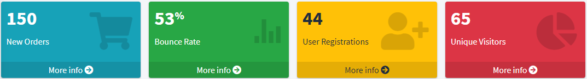
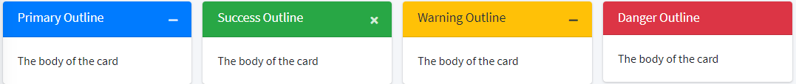
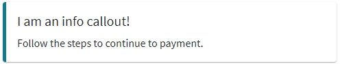
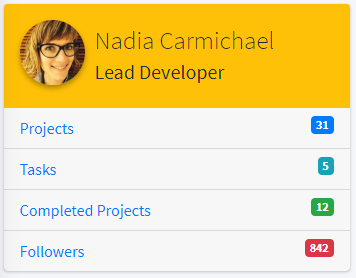

# AdminLTE Blade Components for Laravel 7+

[](https://packagist.org/packages/dgvai/laravel-adminlte-components)
[](https://packagist.org/packages/dgvai/laravel-adminlte-components)
[](https://packagist.org/packages/dgvai/laravel-adminlte-components)
[](https://packagist.org/packages/dgvai/laravel-adminlte-components)
[](https://packagist.org/packages/dgvai/laravel-adminlte-components)
[](https://packagist.org/packages/dgvai/laravel-adminlte-components)
[](https://packagist.org/packages/dgvai/laravel-adminlte-components)

This package contains [Laravel Blade Components](https://laravel.com/docs/7.x/blade#components) for [AdminLTE 3](https://adminlte.io/docs/3.0/) free Boostrap admin panel UI Kit. Since, blade components are only available after Laravel 7, thus only laravel 7.x+ can use this package.

## Contents

<!-- TOC -->

- [AdminLTE Blade Components for Laravel 7+](#adminlte-blade-components-for-laravel-7)
    - [Contents](#contents)
    - [Installation](#installation)
    - [Extract Plugins](#extract-plugins)
    - [Configurations](#configurations)
    - [Components](#components)
        - [Widgets](#widgets)
            - [**INFO BOX**](#info-box)
            - [**SMALL BOX**](#small-box)
            - [**CARDS**](#cards)
            - [**ALERT**](#alert)
            - [**CALLOUT**](#callout)
            - [**PROGRESS**](#progress)
            - [**PROFILE FLAT**](#profile-flat)
            - [**PROFILE WIDGET**](#profile-widget)
            - [**MODAL**](#modal)
            - [**DATATABLE**](#datatable)
        - [Form Components](#form-components)
            - [INPUT](#input)
            - [INPUT-FILE](#input-file)
            - [INPUT-COLOR](#input-color)
            - [INPUT-DATE](#input-date)
            - [DATE-RANGE](#date-range)
            - [INPUT-SWITCH](#input-switch)
            - [INPUT-TAG](#input-tag)
            - [INPUT-SLIDER](#input-slider)
            - [SELECT](#select)
            - [SELECT2](#select2)
            - [SELECT-ICON](#select-icon)
            - [TEXTAREA](#textarea)
            - [TEXT-EDITOR](#text-editor)
            - [SUBMIT](#submit)
    - [Example Codes](#example-codes)
    - [Summary](#summary)
    - [Changelog](#changelog)
    - [License](#license)

<!-- /TOC -->

## Installation

You can install the package via composer:

``` bash
    composer require dgvai/laravel-adminlte-components
```

## Extract Plugins
``` bash
    php artisan vendor:publish --tag=adminlte-dg-plugins
```

## Configurations
You can use this package, stand alone with AdminLTE installed in your app. You just need to add an ``@yield('js')`` at the bottom of your <kbd>master</kbd> blade layout.

Or, if you use [jeroennoten/Laravel-AdminLTE](https://github.com/jeroennoten/Laravel-AdminLTE) package, then you do not need to add anything at ``master``. I will prefer to use this package.

Use this in the [jeroennoten/Laravel-AdminLTE](https://github.com/jeroennoten/Laravel-AdminLTE) config: 
```php 
        [
            'name' => 'AdminLTE-Components-DG',
            'active' => true,
            'files' => [
                [
                    'type' => 'css',
                    'asset' => true,
                    'location' => '/vendor/dg-plugins/select2/css/select2.min.css',
                ],
                [
                    'type' => 'css',
                    'asset' => true,
                    'location' => '/vendor/dg-plugins/select2/css/select2-bootstrap4.min.css',
                ],
                [
                    'type' => 'js',
                    'asset' => true,
                    'location' => '/vendor/dg-plugins/select2/js/select2.min.js',
                ],
                [
                    'type' => 'js',
                    'asset' => true,
                    'location' => '/vendor/dg-plugins/bs-custom-file-input/bs-custom-file-input.min.js',
                ],
                [
                    'type' => 'js',
                    'asset' => true,
                    'location' => '/vendor/dg-plugins/moment/moment.min.js',
                ],
                [
                    'type' => 'css',
                    'asset' => true,
                    'location' => '/vendor/dg-plugins/tempusdominus-bootstrap-4/css/tempusdominus-bootstrap-4.min.css',
                ],
                [
                    'type' => 'js',
                    'asset' => true,
                    'location' => '/vendor/dg-plugins/tempusdominus-bootstrap-4/js/tempusdominus-bootstrap-4.min.js',
                ],
                [
                    'type' => 'css',
                    'asset' => true,
                    'location' => '/vendor/dg-plugins/summernote/summernote-bs4.css',
                ],
                [
                    'type' => 'js',
                    'asset' => true,
                    'location' => '/vendor/dg-plugins/summernote/summernote-bs4.min.js',
                ],
                [
                    'type' => 'css',
                    'asset' => true,
                    'location' => '/vendor/dg-plugins/bs-select/css/bootstrap-select.min.css',
                ],
                [
                    'type' => 'js',
                    'asset' => true,
                    'location' => '/vendor/dg-plugins/bs-select/js/bootstrap-select.min.js',
                ],
                [
                    'type' => 'css',
                    'asset' => true,
                    'location' => '/vendor/dg-plugins/bootstrap-tags-input/bootstrap-tagsinput.css',
                ],
                [
                    'type' => 'js',
                    'asset' => true,
                    'location' => '/vendor/dg-plugins/bootstrap-tags-input/bootstrap-tagsinput.js',
                ],
                [
                    'type' => 'js',
                    'asset' => true,
                    'location' => '/vendor/dg-plugins/daterangepicker/daterangepicker.js',
                ],
                [
                    'type' => 'css',
                    'asset' => true,
                    'location' => '/vendor/dg-plugins/daterangepicker/daterangepicker.css',
                ],
                [
                    'type' => 'css',
                    'asset' => true,
                    'location' => '/vendor/dg-plugins/bootstrap-colorpicker/css/bootstrap-colorpicker.min.css',
                ],
                [
                    'type' => 'js',
                    'asset' => true,
                    'location' => '/vendor/dg-plugins/bootstrap-colorpicker/js/bootstrap-colorpicker.min.js',
                ],
                [
                    'type' => 'css',
                    'asset' => true,
                    'location' => '/vendor/dg-plugins/bootstrap-slider/css/bootstrap-slider.min.css',
                ],
                [
                    'type' => 'js',
                    'asset' => true,
                    'location' => '/vendor/dg-plugins/bootstrap-slider/js/bootstrap-slider.min.js',
                ],
            ],
        ],

```

## Components

### Widgets

#### **INFO BOX**  
  
  

**MINIMUM USAGE**  
```html
<x-dg-info-box title="Order" text="12" />
```
**ALL AVAILABLE ATTRIBUTES**  
| ATTRIBUTE | DETAILS                                                                                    | REQUIRED | TYPE    |
|-----------|--------------------------------------------------------------------------------------------|----------|---------|
| title     | Title of the info box                                                                      | true     | string  |
| text      | Data text                                                                                  | true     | string  |
| bg        | Background Color of the icon. This follows bootstrap colors: success, info, primary... etc | false    | string  |
| icon      | The fontawesome icon class. Eg. ``fas fa-star``, ``fas fa-user-plus``                      | false    | string  |
| grad      | Use gradient color? ``true/false``                                                         | false    | boolean |
| full      | Use full INFO BOX? ``true/false``                                                          | false    | boolean |
| progress      | Show Progress bar?                                                          | false    | int |
| comment      | Show comment?                                                           | false    | string |
| id      | Dynamic Binding?                                                          | false    | string |

**EXAMPLE**
```html
<x-dg-info-box bg="success" title="Yo title" text="123" icon="fas fa-star" :full="true" :grad="true"/>
```

**DYNAMIC BINDINGS**  
Set ``id`` attibute, this will enable dynamic attributes for:
| ID |
|----|
|#{id}-title|
|#{id}-text|
|#{id}-progress|
|#{id}-comment|

**EXAMPLE**
```html
<x-dg-info-box bg="success" title="Users" text="100" icon="fas fa-star" :full="true" :grad="true" id="userbox" />

<script>
    $(()=>{
        $('#userbox-title').text('Users');
        $('#userbox-text').text('102');
    });
</script>
```


#### **SMALL BOX**  


**MINIMUM USAGE**  
```html
<x-dg-small-box title="New User" text="500" />
```
**ALL AVAILABLE ATTRIBUTES**  
| ATTRIBUTE | DETAILS                                                                                    | REQUIRED | TYPE    |
|-----------|--------------------------------------------------------------------------------------------|----------|---------|
| title     | Title of the info box                                                                      | true     | string  |
| text      | Data text                                                                                  | true     | string  |
| bg        | Background Color of the icon. This follows bootstrap colors: success, info, primary... etc | false    | string  |
| icon      | The fontawesome icon class. Eg. ``fas fa-star``, ``fas fa-user-plus``                      | false    | string  |
| url       | The url to follow.                                                                         | false    | string  |
| urlText   | Text of the HyperLink.                                                                     | false    | string  |
| loading   | Set loading state ``true/false``                                                           | false    | boolean |
| id      | Dynamic Binding?                                                          | false    | string |

**EXAMPLE**
```html
<x-dg-small-box title="Small box" text="500" bg="warning" url="#" urlText="See More" loading="false" />
```

**DYNAMIC BINDINGS**  
Set ``id`` attibute, this will enable dynamic attributes for:
| ID |
|----|
|#{id}-title|
|#{id}-text|
|#{id}-link|

**EXAMPLE**
```html
<x-dg-small-box title="Small box" text="500" bg="warning" url="#" urlText="See More" loading="false" $id="userbox"/>

<script>
    $(()=>{
        $('#userbox-text').text('102');
        $('#userbox-link').attr('href',new.link);
    });
</script>
```

#### **CARDS**  


**MINIMUM USAGE**  
```html
<x-dg-card title="Title">
    ...
</x-dg-card>
```
**ALL AVAILABLE ATTRIBUTES**  
| ATTRIBUTE   | DETAILS                                                                                    | REQUIRED | TYPE    |
|-------------|--------------------------------------------------------------------------------------------|----------|---------|
| title       | Title of the Card                                                                          | true     | string  |
| bg          | Background Color of the icon. This follows bootstrap colors: success, info, primary... etc | false    | string  |
| collapsed   | Is Collapsed? ``true/false``                                                               | false    | boolean |
| removable   | Is removable? ``true/false``                                                               | false    | boolean |
| maximizable | Is maximizable? ``true/false``                                                             | false    | boolean |
| disabled    | Is disabled? ``true/false``                                                                | false    | boolean |
| outline     | Is outlined? ``true/false``                                                                | false    | boolean |
| full        | Is full background? ``true/false``                                                         | false    | boolean |

**EXAMPLE**
```html
<x-dg-card title="Title" bg="primary" :outline="true" :full="true" :collapsed="false" :maximizable="true"           :removable="true" :disabled="false">
    ...
</x-dg-card>
```

#### **ALERT**  


**MINIMUM USAGE**  
```html
<x-dg-alert title="Alert!">
    This is alert
</x-dg-alert>
```
**ALL AVAILABLE ATTRIBUTES**  
| ATTRIBUTE   | DETAILS                                                       | REQUIRED | TYPE    |
|-------------|---------------------------------------------------------------|----------|---------|
| title       | Title of the Alert                                            | true     | string  |
| type        | Type of alert. Boostrap types: success, info, primary,... etc | false    | string  |
| dismissable | Is the alert dismissable? ``true/false``                      | false    | boolean |

**EXAMPLE**
```html
<x-dg-alert type="danger" title="Error!" :dismissable="true">
    This is alert
</x-dg-alert>
```

#### **CALLOUT**  


**MINIMUM USAGE**  
```html
<x-dg-callout>This is callout</x-dg-callout>
```
**ALL AVAILABLE ATTRIBUTES**  
| ATTRIBUTE | DETAILS                                                       | REQUIRED | TYPE   |
|-----------|---------------------------------------------------------------|----------|--------|
| title     | Title of the Callout                                          | false    | string |
| type      | Type of alert. Boostrap types: success, info, primary,... etc | false    | string |

**EXAMPLE**
```html
<x-dg-callout type="warning" title="Oops!">
    This is callout
</x-dg-callout>
```

#### **PROGRESS**  


**MINIMUM USAGE**  
```html
<x-dg-progress value="56"/>
```
**ALL AVAILABLE ATTRIBUTES**  
| ATTRIBUTE | DETAILS                                                             | REQUIRED | TYPE    |
|-----------|---------------------------------------------------------------------|----------|---------|
| bg        | Type of background. Boostrap backgd: success, info, primary,... etc | false    | string  |
| size      | Size or progress bar: sm, xs, xxs                                   | false    | string  |
| value     | Value of progress.                                                  | true     | numeric |
| stripped  | Is stripped design? ``true/false``                                  | false    | boolean |
| vertical  | Is vertical? ``true/false``                                         | false    | boolean |

**EXAMPLE**
```html
<x-dg-progress value="56" bg="danger" size="sm" :stripped="true" :vertical="false"/>
```

#### **PROFILE FLAT**  


**USAGE**  
```html
<x-dg-profile-flat img="https://via.placeholder.com/150" name="Nadia Carmicheal" desc="Lead Developer">
    <x-dg-profile-flat-item title="Projects" text="31" url="#" badge="primary"/>
    <x-dg-profile-flat-item title="Tasks" text="5" />
    <x-dg-profile-flat-item title="Completed Projects" text="12" badge="success" />
    <x-dg-profile-flat-item title="Followers" text="842" badge="danger" />
</x-dg-profile-flat>
```

#### **PROFILE WIDGET**  


**USAGE**  
```html
<x-dg-profile-widget img="https://via.placeholder.com/150" name="Alexander Prince" desc="Founder CEO" bg="info">
    <x-dg-profile-widget-item title="followers" text="533"/>
    <x-dg-profile-widget-item title="sales" text="20" col="4"/>
    <x-dg-profile-widget-item title="inbox" text="0"/>
</x-dg-profile-widget>

<x-dg-profile-widget img="https://via.placeholder.com/150" name="Elizabeth Pierce" desc="Founder CEO" cover="https://via.placeholder.com/150">
    <x-dg-profile-widget-item title="followers" text="533"/>
    <x-dg-profile-widget-item title="sales" text="20" col="4"/>
    <x-dg-profile-widget-item title="inbox" text="0"/>
</x-dg-profile-widget>
```

#### **MODAL**  

**MINIMUM USAGE**  
```html
<x-dg-modal id="login_modal" title="Modal Title">
    ...
</x-dg-modal>
```
**ALL AVAILABLE ATTRIBUTES**  
| ATTRIBUTE | DETAILS                            | REQUIRED | TYPE    |
|-----------|------------------------------------|----------|---------|
| id        | ID of modal                        | true     | string  |
| title     | Title of modal                     | true     | string  |
| size      | modal size: sm,lg,fluid            | false    | string  |
| centered  | is centered? ``true/false``        | false    | boolean |
| index     | No of index. (Modal up on a modal) | false    | integer |

**EXAMPLE**
```html
<x-dg-modal id="login_modal" title="Modal Title" size="sm" :centered="true" index="1">
    ...
</x-dg-modal>
```

#### **DATATABLE**  

**MINIMUM USAGE**  
```html
<x-dg-datatable id="sales-table" :heads="['#','Name','Phone','Actions']"/>
...

<script>
$(()=>{
   $('#sales-table').Datatable({
       ...
       ...
   });
});
</script>
```
**ALL AVAILABLE ATTRIBUTES**  
| ATTRIBUTE | DETAILS                       | REQUIRED | TYPE    |
|-----------|-------------------------------|----------|---------|
| id        | ID of the table               | true     | string  |
| heads     | Array of the headings (thead) | true     | array   |
| beautify  | to beautify? ``true/false``   | false    | boolean |
| bordered  | is bordered? ``true/false``   | false    | boolean |
| hoverable | is hoverable? ``true/false``  | false    | boolean |
| condensed | is condensed? ``true/false``  | false    | boolean |
| footer    | has footer? ``true/false``    | false    | boolean |
| buttons    | has buttons (print/export)? ``true/false``    | false    | boolean |

**ACKNOWLEDGEMENTS**
Use ``Dom : 'Blftrip'`` while using buttons. See Examples to be more clear!

### Form Components

#### INPUT
**USAGE**
```html
<x-dg-input />
```

**ALL AVAILABLE ATTRIBUTES**  
| ATTRIBUTE   | DETAILS                         | DEFAULT     | TYPE    |
|-------------|---------------------------------|-------------|---------|
| type        | Input Type                      | text        | string  |
| id          | Input ID                        | null        | string  |
| name        | Input name                      | null        | string  |
| label       | Input Label                     | Input Label | string  |
| placeholder | Input placeholder               | null        | string  |
| topclass    | class along with 'fomr-group'   | null        | string  |
| inputclass  | class along with 'form-control' | null        | string  |
| value       | Input value                     | null        | string  |
| disabled    | is disabled?                    | false       | boolean |
| required    | is required?                    | false       | boolean |
| step    | HTML Attr: step                    | false       | int |
| max    | HTML Attr: max                    | false       | int |
| maxlength    | HTML Attr: maxlength                    | false       | int |
| pattern    | HTML Attr: pattern                    | false       | regex |

#### INPUT-FILE
**REQUIRES**  
[bs-custom-file-input.min.js](https://www.npmjs.com/package/bs-custom-file-input)  

**USAGE**
```html
<x-dg-input-file />
```

**ALL AVAILABLE ATTRIBUTES**  
| ATTRIBUTE   | DETAILS                         | DEFAULT     | TYPE    |
|-------------|---------------------------------|-------------|---------|
| id          | Input ID                        | null        | string  |
| name        | Input name                      | null        | string  |
| label       | Input Label                     | Input Label | string  |
| placeholder | Input placeholder               | null        | string  |
| topclass    | class along with 'fomr-group'   | null        | string  |
| inputclass  | class along with 'form-control' | null        | string  |
| value       | Input value                     | null        | string  |
| disabled    | is disabled?                    | false       | boolean |
| required    | is required?                    | false       | boolean |
| multiple    | is multiple?                    | false       | boolean |

#### INPUT-COLOR
**REQUIRES**  
[bootstrap-colorpicker](https://www.npmjs.com/package/bootstrap-colorpicker)  

**USAGE**
```html
<x-dg-input-color id="myID" />
```

**ALL AVAILABLE ATTRIBUTES**  
| ATTRIBUTE   | DETAILS                         | DEFAULT     | TYPE    |
|-------------|---------------------------------|-------------|---------|
| id          | Input ID                        | null        | string  |
| name        | Input name                      | null        | string  |
| label       | Input Label                     | Input Label | string  |
| placeholder | Input placeholder               | null        | string  |
| topclass    | class along with 'fomr-group'   | null        | string  |
| inputclass  | class along with 'form-control' | null        | string  |
| value       | Input value                     | null        | string  |
| disabled    | is disabled?                    | false       | boolean |
| required    | is required?                    | false       | boolean |

#### INPUT-DATE
**REQUIRES**  
[tempusdominus-bootstrap-4](https://tempusdominus.github.io/bootstrap-4/)  

**USAGE**
```html
<x-dg-input-date id="myID" />
```

**ALL AVAILABLE ATTRIBUTES**  
| ATTRIBUTE   | DETAILS                         | DEFAULT     | TYPE    |
|-------------|---------------------------------|-------------|---------|
| id          | Input ID                        | null        | string  |
| name        | Input name                      | null        | string  |
| label       | Input Label                     | Input Label | string  |
| placeholder | Input placeholder               | null        | string  |
| topclass    | class along with 'fomr-group'   | null        | string  |
| inputclass  | class along with 'form-control' | null        | string  |
| value       | Input value                     | null        | string  |
| disabled    | is disabled?                    | false       | boolean |
| required    | is required?                    | false       | boolean |
| format      | [Moment.js](https://momentjs.com/docs/#/displaying/format/) datetime format       | YYYY-MM-DD  | string  |

#### DATE-RANGE
**REQUIRES**  
[datetimepicker](https://www.daterangepicker.com/) 

**USAGE**
```html
<x-dg-date-range id="picker" callback="console.log('this is callback function')" />
```
**ALL AVAILABLE ATTRIBUTES**  
| ATTRIBUTE   | DETAILS                         | DEFAULT     | TYPE    |
|-------------|---------------------------------|-------------|---------|
| id          | Input ID                        | null        | string  |
| title       | Input Title                     | Filter Range        | string  |
| icon        | Icon                            | far fa-calendar-alt | string  |
| topclass    | class along with 'fomr-group'   | null        | string  |
| inputclass    | class along with 'filter button'   | null        | string  |
| init   | The initial position of range, (0-5) * | 2        | integer  |
| callback  | The JS callback function to run on change filter | null | string (js)  |

**\* init**  
0 - Today  
1 - Yesterday  
2 - Last 7 Days  
3 - Last 30 Days  
4 - This Month  
5 - Last Month  


#### INPUT-SWITCH
**REQUIRES**  
[bootstrap-switch](https://bttstrp.github.io/bootstrap-switch/)  

**USAGE**
```html
<x-dg-input-switch/>
```

**ALL AVAILABLE ATTRIBUTES**  
| ATTRIBUTE   | DETAILS                         | DEFAULT     | TYPE    |
|-------------|---------------------------------|-------------|---------|
| id          | Input ID                        | null        | string  |
| name        | Input name                      | null        | string  |
| label       | Input Label                     | Input Label | string  |
| placeholder | Input placeholder               | null        | string  |
| topclass    | class along with 'fomr-group'   | null        | string  |
| inputclass  | class along with 'form-control' | null        | string  |
| disabled    | is disabled?                    | false       | boolean |
| required    | is required?                    | false       | boolean |
| checked     | is checked?                     | false       | boolean |

#### INPUT-TAG
**REQUIRES**  
[bootstrap-tagsinput](https://bootstrap-tagsinput.github.io/bootstrap-tagsinput/examples/)  

**USAGE**
```html
<x-dg-input-tag/>
```

**ALL AVAILABLE ATTRIBUTES**  
| ATTRIBUTE   | DETAILS                         | DEFAULT     | TYPE    |
|-------------|---------------------------------|-------------|---------|
| id          | Input ID                        | null        | string  |
| name        | Input name                      | null        | string  |
| label       | Input Label                     | Input Label | string  |
| placeholder | Input placeholder               | null        | string  |
| topclass    | class along with 'fomr-group'   | null        | string  |
| inputclass  | class along with 'form-control' | null        | string  |
| disabled    | is disabled?                    | false       | boolean |
| required    | is required?                    | false       | boolean |
| max         | max tag count                   | 10          | integer |

#### INPUT-SLIDER
**REQUIRES**  
[bootstrap-slider](https://github.com/seiyria/bootstrap-slider)  

**USAGE**
```html
<x-dg-input-slider id="myID"/>
```

**ALL AVAILABLE ATTRIBUTES**  
| ATTRIBUTE   | DETAILS                         | DEFAULT     | TYPE    |
|-------------|---------------------------------|-------------|---------|
| id          | Input ID                        | none        | string  |
| name        | Input name                      | null        | string  |
| label       | Input Label                     | Input Label | string  |
| topclass    | class along with 'fomr-group'   | null        | string  |
| inputclass  | class along with 'form-control' | null        | string  |
| disabled    | is disabled?                    | false       | boolean |
| required    | is required?                    | false       | boolean |
| min         | minimum                         | 0           | signed int |
| max         | maximum                         | 100           | signed int |
| value         | value                         | null           | string |
| color         | blue, green, red, teal, yellow, purple | blue  | string |
| tick         | Enable Tick? | false  | boolean |
| ticks         | Ticks : [0, 10, 20, ...] | null  | string |
| tickLabels         | Tick Labels : ["low", "medium", "high" ...] | null  | string |
| vertical         | Is vertical? | false  | boolean |


#### SELECT 

**USAGE**
```html
<x-dg-select id="myID">
    <x-dg-option value="val">Text</x-dg-option>
</x-dg-select>
```

**ALL AVAILABLE ATTRIBUTES: SELECT**  
| ATTRIBUTE   | DETAILS                         | DEFAULT     | TYPE    |
|-------------|---------------------------------|-------------|---------|
| id          | Input ID                        | null        | string  |
| name        | Input name                      | null        | string  |
| label       | Input Label                     | Input Label | string  |
| topclass    | class along with 'fomr-group'   | null        | string  |
| inputclass  | class along with 'form-control' | null        | string  |
| disabled    | is disabled?                    | false       | boolean |
| required    | is required?                    | false       | boolean |
| multiple    | is multiple?                    | false       | boolean |

**ALL AVAILABLE ATTRIBUTES: OPTION**  
| ATTRIBUTE | DETAILS         | DEFAULT | TYPE    |
|-----------|-----------------|---------|---------|
| value     | value of option | null    | string  |
| selected  | is selected?    | false   | boolean |
| disabled  | is disabled?    | false   | boolean |

#### SELECT2 
**REQUIRES**  
[select2](https://select2.org/)  

**USAGE**
```html
<x-dg-select2 id="myID">
    <x-dg-option value="val">Text</x-dg-option>
</x-dg-select2>
```

**ALL AVAILABLE ATTRIBUTES: SELECT**  
| ATTRIBUTE   | DETAILS                         | DEFAULT     | TYPE    |
|-------------|---------------------------------|-------------|---------|
| id          | Input ID                        | null        | string  |
| name        | Input name                      | null        | string  |
| label       | Input Label                     | Input Label | string  |
| topclass    | class along with 'fomr-group'   | null        | string  |
| inputclass  | class along with 'form-control' | null        | string  |
| disabled    | is disabled?                    | false       | boolean |
| required    | is required?                    | false       | boolean |
| multiple    | is multiple?                    | false       | boolean |

**ALL AVAILABLE ATTRIBUTES: OPTION**  
| ATTRIBUTE | DETAILS         | DEFAULT | TYPE    |
|-----------|-----------------|---------|---------|
| value     | value of option | null    | string  |
| selected  | is selected?    | false   | boolean |
| disabled  | is disabled?    | false   | boolean |

#### SELECT-ICON 
**REQUIRES**  
[bootstrap-select](https://developer.snapappointments.com/bootstrap-select/)  

**USAGE**
```html
<x-dg-select-icon id="myID">
    <x-dg-option value="val" icon="true" content="fas fa-star">Text</x-dg-option>
</x-dg-select-icon>
```

**ALL AVAILABLE ATTRIBUTES: SELECT**  
| ATTRIBUTE   | DETAILS                         | DEFAULT     | TYPE    |
|-------------|---------------------------------|-------------|---------|
| id          | Input ID                        | null        | string  |
| name        | Input name                      | null        | string  |
| label       | Input Label                     | Input Label | string  |
| topclass    | class along with 'fomr-group'   | null        | string  |
| inputclass  | class along with 'form-control' | null        | string  |
| disabled    | is disabled?                    | false       | boolean |
| required    | is required?                    | false       | boolean |
| multiple    | is multiple?                    | false       | boolean |

**ALL AVAILABLE ATTRIBUTES: OPTION**  
| ATTRIBUTE | DETAILS         | DEFAULT | TYPE    |
|-----------|-----------------|---------|---------|
| value     | value of option | null    | string  |
| icon      | has icon?       | false   | boolean |
| content   | icon class      | null    | string  |
| selected  | is selected?    | false   | boolean |
| disabled  | is disabled?    | false   | boolean |

#### TEXTAREA 

**USAGE**
```html
<x-dg-textarea>Hi,,,</x-dg-textarea>
```

**ALL AVAILABLE ATTRIBUTES**  
| ATTRIBUTE   | DETAILS                         | DEFAULT     | TYPE    |
|-------------|---------------------------------|-------------|---------|
| id          | Input ID                        | null        | string  |
| name        | Input name                      | null        | string  |
| label       | Input Label                     | Input Label | string  |
| placeholder | Input placeholder               | null        | string  |
| topclass    | class along with 'fomr-group'   | null        | string  |
| inputclass  | class along with 'form-control' | null        | string  |
| disabled    | is disabled?                    | false       | boolean |
| required    | is required?                    | false       | boolean |
| rows        | textarea rows                   | 10          | integer |

#### TEXT-EDITOR
**REQUIRES**  
[summernote](https://summernote.org/)  

**USAGE**
```html
<x-dg-text-editor id="myEditor"/>
```

**ALL AVAILABLE ATTRIBUTES**  
| ATTRIBUTE   | DETAILS                         | DEFAULT     | TYPE    |
|-------------|---------------------------------|-------------|---------|
| id          | Input ID                        | null        | string  |
| name        | Input name                      | null        | string  |
| label       | Input Label                     | Input Label | string  |
| placeholder | Input placeholder               | null        | string  |
| topclass    | class along with 'fomr-group'   | null        | string  |
| inputclass  | class along with 'form-control' | null        | string  |
| disabled    | is disabled?                    | false       | boolean |
| required    | is required?                    | false       | boolean |
| body        | texteditor text body            | null        | long text |
| height      | texteditor height               | 800         | integer |
| fonts       | set custom fonts                | null        | array   |

**Example Fonts Array**
```php
    $fonts = ['Arial', 'Arial Black', 'Comic Sans MS', 'Courier New', 'Impact', 'Montserrat',  'Open Sans'];
```

#### SUBMIT
```html
<x-dg-submit />
```

**ALL AVAILABLE ATTRIBUTES**  
| ATTRIBUTE   | DETAILS                         | DEFAULT     | TYPE    |
|-------------|---------------------------------|-------------|---------|
| type        | button type: success, primary, ...,etc | info    | string |
| topclass    | class along with 'fomr-group'   | null        | string  |
| label       | button label                           | Submit  | string |
| icon        | button icon                     | fas fa-save  | string |
| inputclass  | class along with 'form-control' | null        | string  |

## Example Codes
You can browse through the examples of advanced usages from [examples](examples/) directory. 

## Summary
This document might not be well-documented. I will happily accept any documentation pull-requests.  
> PULL REQUESTS for new components should be in non-master branch


## Changelog

Please see [CHANGELOG](CHANGELOG.md) for more information what has changed recently.

## License

The MIT License (MIT). Please see [License File](LICENSE.md) for more information.
